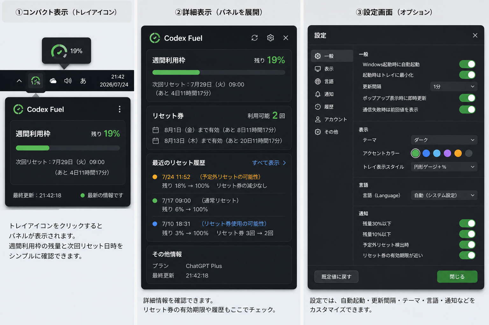

# QuantaTray

[English](#english) · [Windows Installer (.exe)](https://github.com/ukr8b3g-cmyk/QuotaTray/releases/latest/download/QuantaTray-v0.1.1-win-x64-setup.exe) · [Portable ZIP](https://github.com/ukr8b3g-cmyk/QuotaTray/releases/latest/download/QuantaTray-v0.1.1-win-x64-portable.zip)

OpenAI非公式の、Codex利用枠を確認するWindowsタスクトレイ常駐モニターです。



> 画像はUI構成を示すモックアップです。表示内容はCodex App Serverから取得できる情報によって変わります。

## ダウンロード

- [Windows Installer（推奨）](https://github.com/ukr8b3g-cmyk/QuotaTray/releases/latest/download/QuantaTray-v0.1.1-win-x64-setup.exe)
- [Portable ZIP](https://github.com/ukr8b3g-cmyk/QuotaTray/releases/latest/download/QuantaTray-v0.1.1-win-x64-portable.zip)
- [SHA-256チェックサム](https://github.com/ukr8b3g-cmyk/QuotaTray/releases/latest/download/SHA256SUMS.txt)

配布ファイルは現在コード署名されていません。Windows SmartScreenに「不明な発行元」と表示された場合は、GitHub ReleaseのSHA-256と照合してください。

## 概要

QuantaTrayは、公式Codex App Serverの読み取り専用APIを使用し、次の情報を表示します。

- 週間利用枠の残量、次回リセット時刻、カウントダウン
- リセット券の件数と有効期限（取得できる場合）
- 定期リセット、リセット券使用の可能性、予定外リセット候補のローカル履歴
- Codexプランと接続状態
- 60秒ごとの自動更新と手動更新

本アプリはOpenAIの公式製品ではなく、OpenAIによる承認、提携、保証を受けたものではありません。

## 必要環境

- Windows 11 x64推奨
- 公式Codex CLI/App Server
- Codexを利用できるChatGPTアカウント
- インターネット接続

QuantaTrayがバックグラウンドで `codex app-server --stdio` を起動するため、Codexデスクトップ画面を開いておく必要はありません。`codex.exe` を自動検出できない場合は、設定画面でパスを指定できます。

## インストール方法

### Installer版

1. `QuantaTray-v0.1.1-win-x64-setup.exe` をダウンロードします。
2. セットアップを実行し、画面の案内に従います。
3. 更新インストール時は、常駐中のQuantaTrayが自動的に終了します。
4. インストール後、QuantaTrayがタスクトレイに常駐します。

インストール先：

```text
%LOCALAPPDATA%\Programs\QuantaTray\
```

### Portable ZIP版

1. `QuantaTray-v0.1.1-win-x64-portable.zip` をダウンロードします。
2. ZIP全体を書き込み可能なフォルダーへ展開します。
3. `QuantaTray.exe` を実行します。

設定、履歴、ログは展開先の `data` フォルダーへ保存されます。ZIP内から直接実行しないでください。

## 使い方

- トレイアイコンを左クリック：コンパクト表示
- トレイアイコンをダブルクリック：詳細表示
- トレイアイコンを右クリック：主要メニュー
- コンパクト画面の3点メニュー：詳細表示、更新、設定
- 詳細画面の更新アイコン：最新情報を取得
- 詳細画面の歯車アイコン：設定画面
- 設定画面の「閉じる」：設定を保存して閉じる

コンパクト画面と詳細画面は、他のウィンドウを操作しても自動では閉じません。右上の×ボタンを押したときだけトレイへ隠れます。

起動直後は「更新中…」と表示され、Codex App Serverへの初回接続後に数値が反映されます。

## 認証とプライバシー

QuantaTrayはCodex App Serverへローカルstdioで接続します。OpenAIへの通信はCodex App Serverが行います。

- ブラウザCookie、保存パスワード、Codex認証ファイルを直接読み取りません
- パスワード、アクセストークン、会話内容、プロジェクトファイルを収集しません
- テレメトリー、広告、利用解析、開発者運営サーバーはありません
- リセット券を使用する書き込みAPIは呼び出しません

詳細は [PRIVACY.md](PRIVACY.md) を参照してください。

## ローカルデータ

Installer版：

```text
%LOCALAPPDATA%\QuantaTray\
```

Portable版：

```text
<展開フォルダー>\data\
```

保存対象は設定、リセット履歴、機密情報を除いた診断ログです。アンインストール時にローカルデータを削除するか選択できます。

## 対応言語

日本語、英語、簡体字中国語、繁体字中国語、韓国語、ドイツ語、フランス語、スペイン語、ポルトガル語（ブラジル）、ロシア語。

## 制限事項

- App Serverから週間枠が返らない場合、推測値は表示しません。
- リセット券の詳細が返らない場合、件数だけ表示します。
- リセット理由は返されないため、履歴の分類は観測値に基づく推定です。
- 位置固定、位置記憶、画面端吸着、テーマ切替は初期版では未完成です。
- アプリ本体の自動アップデートは未実装です。
- Windows x64以外は未検証です。

## トラブルシューティング

### 数値が表示されない

初回接続には時間がかかる場合があります。詳細画面の接続状態を確認し、更新アイコンを押してください。

### Codexが見つからない

`codex --version` が実行できることを確認してください。QuantaTrayはPATHに加え、公式のユーザー別standalone配置（`%USERPROFILE%\.codex\packages\standalone\releases\`）も自動探索します。必要に応じて、設定画面の「接続」で `codex.exe` のパスを指定します。

### 表示が100%と実際の残量の間で変わる

v0.1.1では製品名をQuantaTrayへ修正し、終了後に非表示プロセスが残って再起動を妨げる問題を修正しました。既存のQuantaTrain v0.1.0から更新する場合も、最新版のセットアップを実行してください。

## 開発

- C# / .NET 10 / Windows Forms
- Codex App Server stdio JSONL
- Inno Setup 6

ビルド方法は [docs/BUILDING.md](docs/BUILDING.md)、プライバシー設計は [PRIVACY.md](PRIVACY.md) を参照してください。

## ライセンス

[MIT License](LICENSE)

OpenAI、ChatGPT、Codexは各権利者の商標です。

---

## English

QuantaTray is an unofficial Windows system-tray monitor for viewing your Codex usage limits.

## Download

- [Windows Installer (recommended)](https://github.com/ukr8b3g-cmyk/QuotaTray/releases/latest/download/QuantaTray-v0.1.1-win-x64-setup.exe)
- [Portable ZIP](https://github.com/ukr8b3g-cmyk/QuotaTray/releases/latest/download/QuantaTray-v0.1.1-win-x64-portable.zip)
- [SHA-256 checksums](https://github.com/ukr8b3g-cmyk/QuotaTray/releases/latest/download/SHA256SUMS.txt)

The current binaries are not code-signed. If Windows SmartScreen shows an unknown-publisher warning, verify the SHA-256 value against the release checksum file.

## What it shows

QuantaTray uses the read-only API provided by the official Codex App Server to display:

- Weekly remaining allowance, next reset time, and countdown
- Reset-credit count and expiry dates when available
- Local history of scheduled resets, possible reset-credit use, and unexpected reset candidates
- Codex plan and connection status
- Automatic polling every 60 seconds and manual refresh

QuantaTray is not an official OpenAI product and is not endorsed, sponsored, or warranted by OpenAI.

## Requirements

- Windows 11 x64 recommended
- Official Codex CLI/App Server
- A ChatGPT account with access to Codex
- Internet connection

QuantaTray launches `codex app-server --stdio` in the background, so the Codex desktop window does not need to remain open. If `codex.exe` cannot be detected automatically, select it in Settings.

## Installation

### Installer

1. Download `QuantaTray-v0.1.1-win-x64-setup.exe`.
2. Run Setup and follow the prompts.
3. During an upgrade, Setup automatically closes the running QuantaTray process.
4. QuantaTray starts in the system tray after installation.

Install location:

```text
%LOCALAPPDATA%\Programs\QuantaTray\
```

### Portable ZIP

1. Download `QuantaTray-v0.1.1-win-x64-portable.zip`.
2. Extract the entire archive to a writable folder.
3. Run `QuantaTray.exe`.

Settings, history, and logs are stored in the extracted `data` folder. Do not run the application directly from inside the ZIP archive.

## Usage

- Left-click the tray icon: open the compact view
- Double-click the tray icon: open the detailed view
- Right-click the tray icon: open the main menu
- Compact-view ellipsis: details, refresh, and settings
- Detail-view refresh icon: request current data
- Detail-view gear icon: open settings
- Settings “Close” button: save settings and close

Compact and detailed views remain visible when they lose focus. They return to the tray only when you press their top-right close button.

The app shows “Updating…” at startup and fills in the values after its first Codex App Server connection.

## Authentication and privacy

QuantaTray communicates with Codex App Server over local stdio. Codex App Server handles communication with OpenAI.

- It does not directly read browser cookies, saved passwords, or Codex authentication files.
- It does not collect passwords, access tokens, conversations, or project files.
- It has no telemetry, ads, analytics, or developer-operated backend.
- It never calls the write API that consumes reset credits.

See [PRIVACY.md](PRIVACY.md) for details.

## Local data

Installed mode:

```text
%LOCALAPPDATA%\QuantaTray\
```

Portable mode:

```text
<extracted folder>\data\
```

Stored data is limited to settings, reset history, and redacted diagnostic logs. The uninstaller asks whether local data should be removed.

## Languages

Japanese, English, Simplified Chinese, Traditional Chinese, Korean, German, French, Spanish, Brazilian Portuguese, and Russian.

## Current limitations

- QuantaTray does not invent a value when App Server does not return a weekly window.
- Only the reset-credit count is shown when individual credit details are unavailable.
- Reset reasons are not provided, so history classifications are inferences from observed values.
- Position locking, position memory, edge snapping, and theme switching are incomplete in the initial release.
- Automatic application updates are not implemented.
- Platforms other than Windows x64 are untested.

## Troubleshooting

### No value appears

The first connection can take some time. Check the connection status in the detailed view, then press the refresh icon.

### Codex is not found

Confirm that `codex --version` works. QuantaTray searches PATH and the official per-user standalone location under `%USERPROFILE%\.codex\packages\standalone\releases\`. If needed, select the `codex.exe` path under Settings → Connection.

### The value switches between 100% and the actual remaining amount

Version 0.1.1 corrects the product name to QuantaTray and fixes an invisible process that could remain after Exit and block relaunch. Run the latest Setup to upgrade from QuantaTrain v0.1.0.

## Development

- C# / .NET 10 / Windows Forms
- Codex App Server stdio JSONL
- Inno Setup 6

See [docs/BUILDING.md](docs/BUILDING.md) for build instructions and [PRIVACY.md](PRIVACY.md) for the privacy model.

## License

[MIT License](LICENSE)

OpenAI, ChatGPT, and Codex are trademarks of their respective owners.
