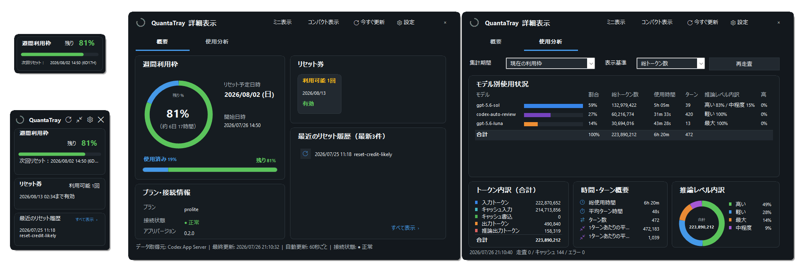
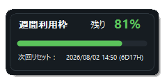
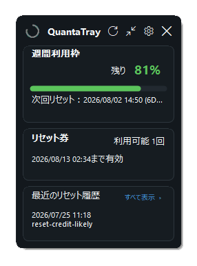
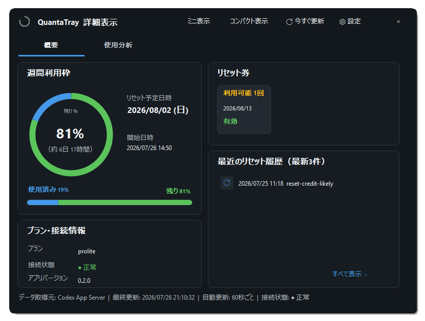
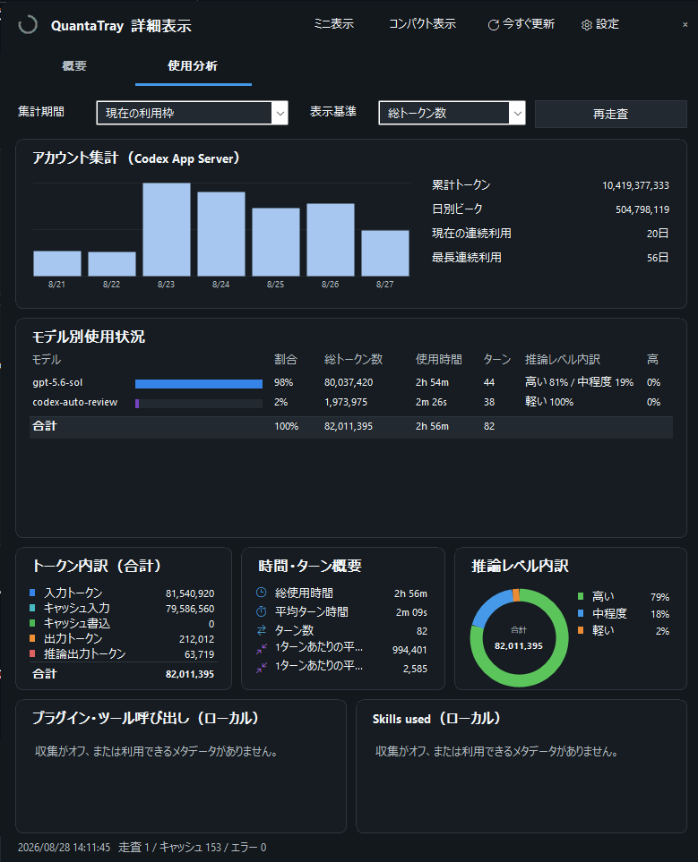
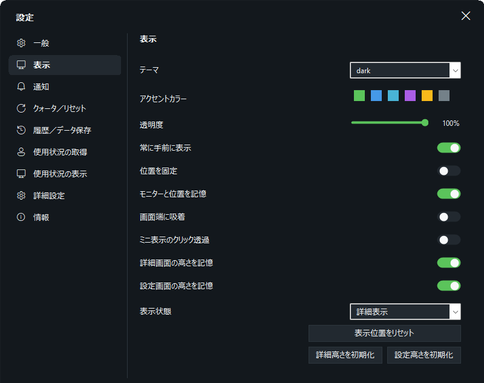
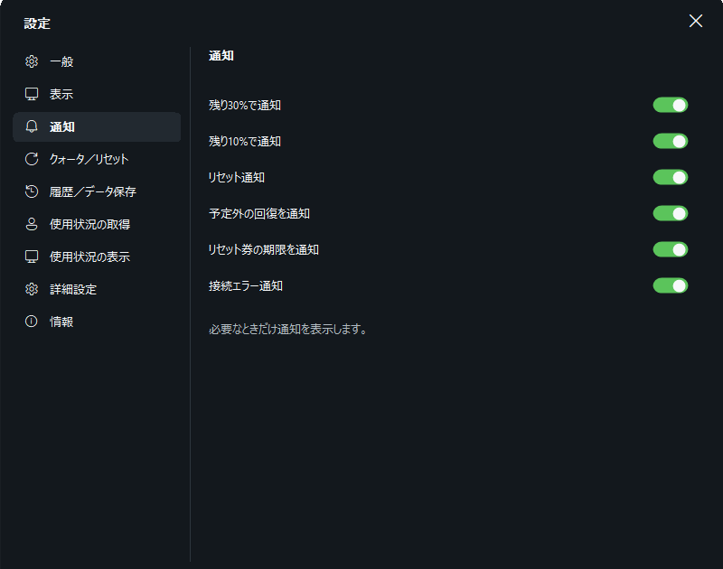
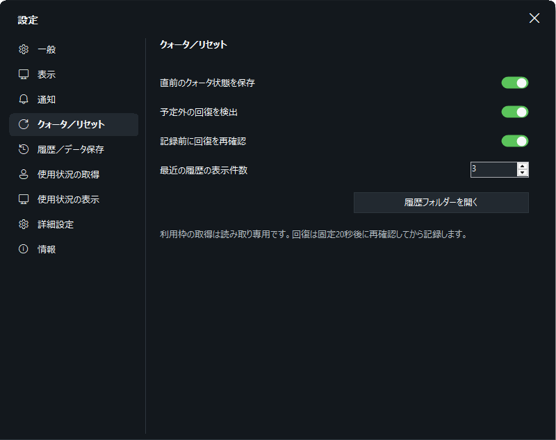
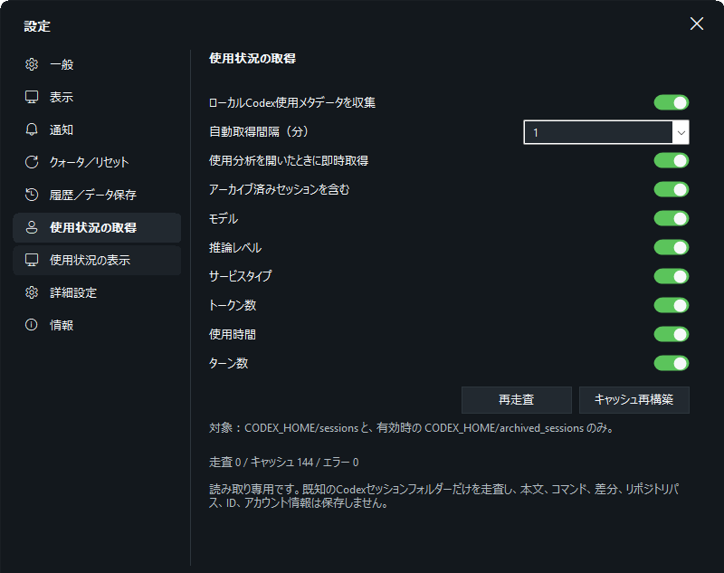
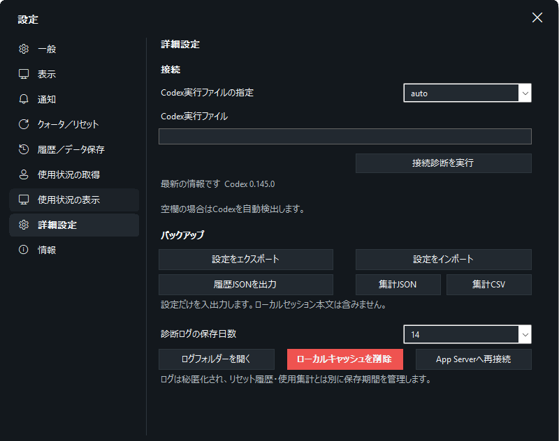

# QuantaTray

[日本語](#日本語) · [English](#english) · [Windows Installer](https://github.com/ukr8b3g-cmyk/QuotaTray/releases/latest/download/QuantaTray-v0.2.7-win-x64-setup.exe) · [Portable ZIP](https://github.com/ukr8b3g-cmyk/QuotaTray/releases/latest/download/QuantaTray-v0.2.7-win-x64-portable.zip) · [SHA-256](https://github.com/ukr8b3g-cmyk/QuotaTray/releases/latest/download/SHA256SUMS.txt)

## 日本語

OpenAI Codexの週間利用枠、次回リセット、リセット券、ローカル使用分析を確認できるWindowsタスクトレイ常駐アプリです。



> QuantaTrayは非公式ソフトウェアです。OpenAIによる承認、提携、支援、保証を受けた製品ではありません。

### ダウンロード

- [Windows Installer（推奨）](https://github.com/ukr8b3g-cmyk/QuotaTray/releases/latest/download/QuantaTray-v0.2.7-win-x64-setup.exe)
- [Portable ZIP](https://github.com/ukr8b3g-cmyk/QuotaTray/releases/latest/download/QuantaTray-v0.2.7-win-x64-portable.zip)
- [SHA-256チェックサム](https://github.com/ukr8b3g-cmyk/QuotaTray/releases/latest/download/SHA256SUMS.txt)

配布ファイルは現在コード署名されていません。Windows SmartScreenに「不明な発行元」と表示された場合は、GitHub ReleaseのSHA-256と照合してください。

### 主な機能

- 週間利用枠の残量、使用済み割合、次回リセット日時、カウントダウン
- リセット券の残数・有効期限と、購入クレジット残高（App Serverから取得できる場合）
- 日別・累計トークン、ピーク、連続利用日数の公式アカウント使用量
- 定期リセット、リセット券使用候補、予定外回復候補のローカル履歴（最近4件）
- プラン、接続状態、最終更新、自動更新状態
- ミニ、コンパクト、詳細の3表示と、それぞれ独立した画面位置記憶
- 横幅を維持して高さを変更・縦スクロールできる詳細画面
- モデル、推論レベル、サービスタイプ、トークン、使用時間、ターン数のローカル集計
- 初期値オフのプラグイン／ツール・Skill回数集計
- 9カテゴリに整理した設定、3年既定の履歴・集計保持、JSON／CSV出力
- 日本語、英語（自動選択ではWindowsが日本語なら日本語、それ以外は英語）
- タブ、表示切り替え、使用分析、主要設定のマウスオーバーヘルプ

QuantaTrayは利用状況を読み取って表示するだけで、リセット券の使用や利用枠の変更は行いません。

### 画面

#### ミニ表示

週間利用枠を最小サイズで表示します。次回リセット日時と残り時間も一行で確認できます。



#### コンパクト表示

週間利用枠、リセット券、最近のリセット履歴を縦詰めで表示します。



#### 詳細表示 — 概要

週間利用枠、リセット予定、リセット券、プラン・接続情報、最近のリセット履歴をまとめて表示します。



#### 詳細表示 — 使用分析

モデル別使用状況、トークン内訳、時間・ターン概要、推論レベル内訳に加え、取得可能な場合は購入クレジット残高と公式アカウント使用量を表示します。

画面上部では集計期間と表示基準を切り替えて再走査できます。「アカウント集計（Codex App Server）」には日別トークン、累計、日別ピーク、現在／最長の連続利用日数を表示します。その下ではローカルのCodexセッションからモデル別の割合・トークン・使用時間・ターン数・推論レベルを集計し、合計トークン内訳、時間・ターン概要、推論レベル内訳を確認できます。プラグイン／ツールとSkill回数は初期状態では収集せず、設定で明示的に有効化した場合だけローカル集計を表示します。



> **`codex-auto-review`について：** Codexが権限判断のために自動実行する内部処理で、ユーザーが選択したメインモデルとは別に記録される場合があります。公開情報からGPT-5.4の軽い推論（low）が使用されている可能性がありますが、内部ルーティングのため確定情報ではありません。

使用分析は初期状態で無効です。設定の「使用状況の取得」で有効化した場合だけ、既知のCodexセッションフォルダーを読み取り専用で走査します。

- 自動取得：1／5／15／30分、または手動のみ
- 初期値：5分
- 使用分析タブを開いた時：即時取得
- 起動時：1回取得
- 再走査：常に実行可能
- 処理中の重複実行を防ぎ、通常は追加分だけを走査

本文、応答、コマンド、差分、作業パス、メールアドレス、アカウントIDは保存しません。

### 設定

設定画面は幅800 logical px固定で、必要に応じて高さだけ変更できます。一般、表示、通知、クォータ／リセット、履歴／データ保存、使用状況の取得、使用状況の表示、詳細設定、情報の9カテゴリです。

<table>
  <tr>
    <td width="50%"><strong>表示</strong><br><a href="docs/images/settings-display-ja.png"></a></td>
    <td width="50%"><strong>通知</strong><br><a href="docs/images/settings-notifications-ja.png"></a></td>
  </tr>
  <tr>
    <td width="50%"><strong>クォータ／リセット</strong><br><a href="docs/images/settings-quota-reset-ja.png"></a></td>
    <td width="50%"><strong>履歴／データ保存</strong><br><a href="docs/images/settings-history-ja.png"></a></td>
  </tr>
  <tr>
    <td width="50%"><strong>使用状況の取得</strong><br><a href="docs/images/settings-usage-acquisition-ja.png"></a></td>
    <td width="50%"><strong>詳細設定・バックアップ</strong><br><a href="docs/images/settings-advanced-ja.png"></a></td>
  </tr>
</table>

### 必要環境

- Windows 11 x64推奨
- 公式Codex CLI／App Server
- Codexを利用できるChatGPTアカウント
- インターネット接続

QuantaTrayはバックグラウンドで `codex app-server --stdio` を起動します。Codexデスクトップ画面を開いておく必要はありません。`codex.exe` を自動検出できない場合は、詳細設定からパスを指定できます。

### インストール

#### Installer版

1. `QuantaTray-v0.2.7-win-x64-setup.exe` をダウンロードします。
2. セットアップを実行します。
3. インストール後、QuantaTrayがタスクトレイに常駐します。

インストール先：

```text
%LOCALAPPDATA%\Programs\QuantaTray\
```

#### Portable ZIP版

1. `QuantaTray-v0.2.7-win-x64-portable.zip` をダウンロードします。
2. ZIP全体を書き込み可能なフォルダーへ展開します。
3. `QuantaTray.exe` を実行します。

設定、履歴、集計、ログは展開先の `data` フォルダーへ保存されます。ZIP内から直接実行しないでください。

### 基本操作

- トレイアイコンを左クリック：コンパクト表示
- トレイアイコンをダブルクリック：詳細表示
- トレイアイコンを右クリック：表示切替、更新、設定、終了
- ミニ表示をダブルクリック：コンパクト表示
- 各画面上部：ミニ／コンパクト／詳細の切替、更新、設定
- 設定ボタンをもう一度押す：設定画面を閉じる

残り30%以下では橙、10%以下では赤を優先し、選択したアクセントカラーより警告色を優先します。

### プライバシーとセキュリティ

QuantaTrayはCodex App Serverへローカルstdioで接続します。OpenAIへの通信はCodex App Serverが行います。

- ブラウザCookie、保存パスワード、Codex認証ファイルを直接読み取りません。
- パスワード、アクセストークン、メールアドレス、アカウントIDを保存しません。
- 会話内容、ソースコード、プロジェクトファイルを保存・外部送信しません。
- テレメトリー、広告、外部送信型分析、開発者運営サーバーはありません。
- リセット券を使用する書き込みAPIは呼び出しません。
- 任意の使用分析はローカル処理のみで、集計結果を外部送信しません。

詳細：

- [PRIVACY.md](PRIVACY.md)
- [SECURITY.md](SECURITY.md)
- [THIRD-PARTY-NOTICES.md](THIRD-PARTY-NOTICES.md)

### ローカルデータ

Installer版：

```text
%LOCALAPPDATA%\QuantaTray\
```

Portable版：

```text
<展開フォルダー>\data\
```

保存対象は設定、直前の利用枠状態、リセット履歴、任意の使用集計、差分走査キャッシュ、機密情報を除いた診断ログです。新規インストールの履歴・集計保持期間は3年です。

### 制限事項

- App Serverから週間枠が返らない場合、推測値は表示しません。
- リセット券の詳細が返らない場合、件数だけ表示します。
- リセット理由は返されないため、履歴分類は観測値に基づく推定です。
- アプリ本体の自動アップデートは未実装です。
- Windows x64以外は未検証です。

### 開発

- C#／.NET 10／Windows Forms
- Codex App Server stdio JSONL
- Inno Setup 6

ビルド方法は [docs/BUILDING.md](docs/BUILDING.md) を参照してください。

不具合・機能要望は [GitHub Issues](https://github.com/ukr8b3g-cmyk/QuotaTray/issues)、脆弱性は [SECURITY.md](SECURITY.md) の手順で報告してください。公開Issueへ認証情報や会話内容などの機密情報を投稿しないでください。

### ライセンス

[MIT License](LICENSE)

OpenAI、ChatGPT、Codexは各権利者の商標です。MIT Licenseは第三者の名称、ロゴ、商標に対する使用許可を与えるものではありません。

---

## English

QuantaTray is an unofficial Windows system-tray monitor for Codex weekly allowance, reset timing, reset credits, and optional local usage analysis.

QuantaTray is not an official OpenAI product and is not affiliated with, endorsed by, sponsored by, or warranted by OpenAI. OpenAI, ChatGPT, and Codex are trademarks of their respective owners.

### Download

- [Windows Installer (recommended)](https://github.com/ukr8b3g-cmyk/QuotaTray/releases/latest/download/QuantaTray-v0.2.7-win-x64-setup.exe)
- [Portable ZIP](https://github.com/ukr8b3g-cmyk/QuotaTray/releases/latest/download/QuantaTray-v0.2.7-win-x64-portable.zip)
- [SHA-256 checksums](https://github.com/ukr8b3g-cmyk/QuotaTray/releases/latest/download/SHA256SUMS.txt)

The current binaries are not code-signed. If Windows SmartScreen shows an unknown-publisher warning, verify the files against `SHA256SUMS.txt`.

### Features

- Weekly remaining allowance, used share, reset time, and countdown
- Reset-credit count, expiry dates, and purchased-credit balance when available
- Official account usage including daily and lifetime tokens, peak usage, and streaks
- Local history of scheduled resets, possible reset-credit use, and unexpected recovery candidates, with four recent rows
- Mini, compact, and detailed views with independently remembered positions
- A height-resizable detailed view with vertical scrolling
- Local-only aggregation of model, reasoning effort, service tier, tokens, elapsed time, and turns
- Opt-in local plugin/tool and skill counters
- Nine consolidated settings categories, three-year default retention, and JSON/CSV exports
- Automatic 60-second quota refresh and manual refresh
- Japanese and English UI; Auto uses Japanese for Japanese Windows display language and English otherwise
- Mouse-over help for tabs, view switching, usage analysis, and key settings

Usage analysis is disabled by default. When enabled, it scans metadata only from known Codex session roots in read-only mode. It can scan every 1, 5, 15, or 30 minutes (5 minutes by default), or manually. Opening the usage tab can trigger an immediate scan; scans do not overlap and normally process only appended data.

QuantaTray displays quota information only. It does not consume reset credits or modify the allowance.

### Requirements

- Windows 11 x64 recommended
- Official Codex CLI／App Server
- A ChatGPT account with Codex access
- Internet connection

QuantaTray launches `codex app-server --stdio` in the background. The Codex desktop window does not need to remain open.

### Install

For the installer, run `QuantaTray-v0.2.7-win-x64-setup.exe`. For the portable edition, extract the entire ZIP to a writable folder and run `QuantaTray.exe`; portable data is stored in the adjacent `data` folder.

### Privacy and security

- Does not directly read browser cookies, saved passwords, or Codex credential files
- Does not store passwords, access tokens, email addresses, or account IDs
- Does not store or transmit conversations, source code, or project files
- Has no telemetry, ads, external analytics, or developer-operated backend
- Never calls the reset-credit consumption API
- Keeps optional usage aggregates local

See [PRIVACY.md](PRIVACY.md), [SECURITY.md](SECURITY.md), and [THIRD-PARTY-NOTICES.md](THIRD-PARTY-NOTICES.md).

### Development

- C# / .NET 10 / Windows Forms
- Codex App Server over stdio JSONL
- Inno Setup 6

See [docs/BUILDING.md](docs/BUILDING.md) for build instructions.

### License

[MIT License](LICENSE)

The MIT License covers the project software. It does not grant rights to OpenAI, ChatGPT, Codex, or other third-party names, logos, or trademarks.
