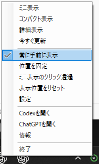
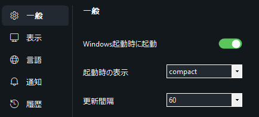
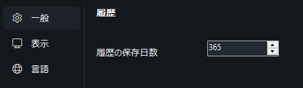
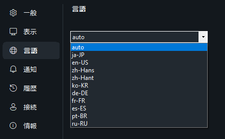

# QuantaTray

[English](#english) · [Windows Installer (.exe)](https://github.com/ukr8b3g-cmyk/QuotaTray/releases/latest/download/QuantaTray-v0.1.3-win-x64-setup.exe) · [Portable ZIP](https://github.com/ukr8b3g-cmyk/QuotaTray/releases/latest/download/QuantaTray-v0.1.3-win-x64-portable.zip) · [SHA-256](https://github.com/ukr8b3g-cmyk/QuotaTray/releases/latest/download/SHA256SUMS.txt)

OpenAI非公式の、Codex利用枠を確認するWindowsタスクトレイ常駐モニターです。


> 画像はUI構成を示すモックアップです。表示内容はCodex App Serverから取得できる情報によって変わります。

## ダウンロード

- [Windows Installer（推奨）](https://github.com/ukr8b3g-cmyk/QuotaTray/releases/latest/download/QuantaTray-v0.1.3-win-x64-setup.exe)
- [Portable ZIP](https://github.com/ukr8b3g-cmyk/QuotaTray/releases/latest/download/QuantaTray-v0.1.3-win-x64-portable.zip)
- [SHA-256チェックサム](https://github.com/ukr8b3g-cmyk/QuotaTray/releases/latest/download/SHA256SUMS.txt)

配布ファイルは現在コード署名されていません。Windows SmartScreenに「不明な発行元」と表示された場合は、GitHub ReleaseのSHA-256と照合してください。

## 概要

QuantaTrayは、公式Codex App Serverの読み取り専用APIを使用し、次の情報を表示します。

- 週間利用枠の残量、次回リセット時刻、カウントダウン
- App Serverが小数値を返す場合、残量を小数第1位まで表示（例：`94.4%`）
- リセット券の件数と有効期限（取得できる場合）
- 定期リセット、リセット券使用の可能性、予定外リセット候補のローカル履歴
- Codexプランと接続状態
- 60秒ごとの自動更新と手動更新

本アプリはOpenAIの公式製品ではなく、OpenAIによる承認、提携、保証を受けたものではありません。

## 必要環境

- Windows 11 x64推奨
- 公式Codex CLI/App Server
- Codexを利用できるChatGPTアカウント
- インターネット接続

QuantaTrayがバックグラウンドで `codex app-server --stdio` を起動するため、Codexデスクトップ画面を開いておく必要はありません。`codex.exe` を自動検出できない場合は、設定画面でパスを指定できます。

## インストール方法

### Installer版

1. `QuantaTray-v0.1.3-win-x64-setup.exe` をダウンロードします。
2. セットアップを実行し、画面の案内に従います。
3. 更新インストール時は、常駐中のQuantaTrayが自動的に終了します。
4. インストール後、QuantaTrayがタスクトレイに常駐します。

インストール先：

```text
%LOCALAPPDATA%\Programs\QuantaTray\
```

### Portable ZIP版

1. `QuantaTray-v0.1.3-win-x64-portable.zip` をダウンロードします。
2. ZIP全体を書き込み可能なフォルダーへ展開します。
3. `QuantaTray.exe` を実行します。

設定、履歴、ログは展開先の `data` フォルダーへ保存されます。ZIP内から直接実行しないでください。

## 使い方

- トレイアイコンを左クリック：コンパクト表示
- トレイアイコンをダブルクリック：詳細表示
- トレイアイコンを右クリック：ミニ／コンパクト／詳細表示と主要設定
- ミニ表示をダブルクリック：コンパクト表示へ戻る
- ミニ表示を右クリック：コンパクト／詳細表示、更新、設定
- コンパクト画面の3点メニュー：ミニ／詳細表示、更新、設定
- 詳細画面の更新アイコン：最新情報を取得
- 詳細画面の歯車アイコン：設定画面
- 設定画面の「閉じる」：設定を保存して閉じる



トレイの右クリックメニューは、表示切替、更新、主要な表示設定、表示位置の復旧に使用します。

### 表示オプションの意味

- **常に手前に表示**：ミニ／コンパクト／詳細を、ほかのウィンドウより前に表示します。
- **位置を固定**：パネルのドラッグ移動だけを禁止します。更新や表示切替などのボタン操作は引き続き使用できます。
- **モニターと位置を記憶**：終了時のモニターと基準位置を保存し、次回起動時に復元します。対象モニターが外れている場合は、メインディスプレイへ自動退避します。
- **画面端に吸着**：移動終了時に、パネルを現在のモニターの作業領域端へ寄せます。
- **ミニ表示のクリック透過**：ミニ表示だけがマウス操作に反応せず、背後のアプリへクリックを通します。コンパクト／詳細には適用されません。ONの間はミニ表示自体を操作できないため、設定変更、表示切替、クリック透過の解除はシステムトレイの右クリックメニューから行います。
- **表示位置をリセット**：パネルが画面外へ移動した場合や初期位置へ戻したい場合に、保存した共通位置を消去し、コンパクト表示をメインディスプレイ中央へ戻します。

表示切替時は、位置固定や位置記憶のON/OFFに関係なく、同じモニターと基準位置を引き継ぎます。「すべての設定を初期化」は確認後に、表示位置を含む全設定を初期値へ戻します。

起動直後は「更新中…」と表示され、Codex App Serverへの初回接続後に数値が反映されます。

## 主な設定

### 起動と更新



- **Windows起動時に起動**：Windowsへのサインイン後にQuantaTrayを自動起動します。初期値はOFFです。
- **起動時の表示**：トレイのみ、ミニ、コンパクト、詳細から選択できます。初期値はトレイのみです。
- **更新間隔**：App Serverへ最新状態を問い合わせる間隔を選択します。初期値は60秒です。「今すぐ更新」で手動取得もできます。

## 認証とプライバシー

QuantaTrayはCodex App Serverへローカルstdioで接続します。OpenAIへの通信はCodex App Serverが行います。

- ブラウザCookie、保存パスワード、Codex認証ファイルを直接読み取りません
- パスワード、アクセストークン、会話内容、プロジェクトファイルを収集しません
- テレメトリー、広告、利用解析、開発者運営サーバーはありません
- リセット券を使用する書き込みAPIは呼び出しません

詳細は [PRIVACY.md](PRIVACY.md) を参照してください。

## ローカルデータ

Installer版：

```text
%LOCALAPPDATA%\QuantaTray\
```

Portable版：

```text
<展開フォルダー>\data\
```

保存対象は設定、リセット履歴、機密情報を除いた診断ログです。アンインストール時にローカルデータを削除するか選択できます。

### 最近のリセット履歴



履歴の保存日数は変更でき、初期値は365日です。QuantaTrayの動作中に取得した前後の観測値を比較し、大きな残量回復を次のようにローカル分類します。

- **通常リセット**：予定された週間リセット時刻付近で残量が回復した場合
- **リセット券使用の可能性**：予定日前に残量が回復し、リセット券数の減少も確認された場合
- **予定外リセット候補**：予定日前に残量が大きく回復し、リセット券数の減少や利用枠構成の変更が確認されない場合

過去のリセットをサーバーから一括取得する機能ではありません。QuantaTrayが起動して観測できたタイミングで履歴へ追加され、理由がAPIから返らない場合の分類は観測値に基づく推定です。

リセット券は件数と有効期限を表示するだけです。QuantaTrayから券を使用したり、利用枠をリセットしたりする操作はできません。

## 対応言語



`auto`はWindowsの表示言語へ追従します。手動では、日本語、英語、簡体字中国語、繁体字中国語、韓国語、ドイツ語、フランス語、スペイン語、ポルトガル語（ブラジル）、ロシア語から選択できます。

## 制限事項

- App Serverから週間枠が返らない場合、推測値は表示しません。
- リセット券の詳細が返らない場合、件数だけ表示します。
- リセット理由は返されないため、履歴の分類は観測値に基づく推定です。
- アプリ本体の自動アップデートは未実装です。
- Windows x64以外は未検証です。

## トラブルシューティング

### 数値が表示されない

初回接続には時間がかかる場合があります。詳細画面の接続状態を確認し、更新アイコンを押してください。

### Codexが見つからない

`codex --version` が実行できることを確認してください。QuantaTrayはPATHに加え、公式のユーザー別standalone配置（`%USERPROFILE%\.codex\packages\standalone\releases\`）も自動探索します。必要に応じて、設定画面の「接続」で `codex.exe` のパスを指定します。

### 表示が100%と実際の残量の間で変わる

v0.1.3では設定変更を直列処理し、テーマ・アクセント色・言語を連続変更しても表示パネルを安全に再構築します。クリック透過中のミニ表示は、設定を閉じた後やトレイから選び直した時に、フォーカスを奪わず再表示されます。既存版から更新する場合は、最新版のセットアップを実行してください。

### ミニ表示をクリックできない

「ミニ表示のクリック透過」がONです。解除方法は上記の[「表示オプションの意味」](#表示オプションの意味)を参照してください。

### パネルが画面外にある

トレイの右クリックメニュー、または設定画面の「表示」から「表示位置をリセット」を実行してください。動作の詳細は[「表示オプションの意味」](#表示オプションの意味)を参照してください。

## 開発

- C# / .NET 10 / Windows Forms
- Codex App Server stdio JSONL
- Inno Setup 6

ビルド方法は [docs/BUILDING.md](docs/BUILDING.md)、プライバシー設計は [PRIVACY.md](PRIVACY.md) を参照してください。

## 不具合報告

不具合や表示崩れを見つけた場合は、[GitHub Issues](https://github.com/ukr8b3g-cmyk/QuotaTray/issues)へ、使用バージョン、表示モード、再現手順、可能であればスクリーンショットを添えて報告してください。アクセストークン、認証ファイル、メールアドレスなどの機密情報は投稿しないでください。

## ライセンス

[CC0 1.0 Universal](LICENSE)

このリポジトリの独自コードと同梱画像は、適用可能な範囲でCC0として公開します。許可申請やクレジット表記なしで、複製、改変、フォーク、再配布、商用利用が可能です。改変版の公開や別アプリへの組み込みも自由です。

CC0は第三者の商標権、特許権、プライバシー権などを放棄するものではなく、ソフトウェアは無保証で提供されます。依存コンポーネントには各ライセンスが適用されます。詳細は [THIRD-PARTY-NOTICES.md](THIRD-PARTY-NOTICES.md) を確認してください。

OpenAI、ChatGPT、Codexは各権利者の商標です。

---

## English

QuantaTray is an unofficial Windows system-tray monitor for viewing your Codex usage limits.

## Download

- [Windows Installer (recommended)](https://github.com/ukr8b3g-cmyk/QuotaTray/releases/latest/download/QuantaTray-v0.1.3-win-x64-setup.exe)
- [Portable ZIP](https://github.com/ukr8b3g-cmyk/QuotaTray/releases/latest/download/QuantaTray-v0.1.3-win-x64-portable.zip)
- [SHA-256 checksums](https://github.com/ukr8b3g-cmyk/QuotaTray/releases/latest/download/SHA256SUMS.txt)

The current binaries are not code-signed. If Windows SmartScreen shows an unknown-publisher warning, verify the SHA-256 value against the release checksum file.

## What it shows

QuantaTray uses the read-only API provided by the official Codex App Server to display:

- Weekly remaining allowance, next reset time, and countdown
- One-decimal remaining allowance when supplied by App Server (for example, `94.4%`)
- Reset-credit count and expiry dates when available
- Local history of scheduled resets, possible reset-credit use, and unexpected reset candidates
- Codex plan and connection status
- Automatic polling every 60 seconds and manual refresh

QuantaTray is not an official OpenAI product and is not endorsed, sponsored, or warranted by OpenAI.

## Requirements

- Windows 11 x64 recommended
- Official Codex CLI/App Server
- A ChatGPT account with access to Codex
- Internet connection

QuantaTray launches `codex app-server --stdio` in the background, so the Codex desktop window does not need to remain open. If `codex.exe` cannot be detected automatically, select it in Settings.

## Installation

### Installer

1. Download `QuantaTray-v0.1.3-win-x64-setup.exe`.
2. Run Setup and follow the prompts.
3. During an upgrade, Setup automatically closes the running QuantaTray process.
4. QuantaTray starts in the system tray after installation.

Install location:

```text
%LOCALAPPDATA%\Programs\QuantaTray\
```

### Portable ZIP

1. Download `QuantaTray-v0.1.3-win-x64-portable.zip`.
2. Extract the entire archive to a writable folder.
3. Run `QuantaTray.exe`.

Settings, history, and logs are stored in the extracted `data` folder. Do not run the application directly from inside the ZIP archive.

## Usage

- Left-click the tray icon: open the compact view
- Double-click the tray icon: open the detailed view
- Right-click the tray icon: select mini, compact, or detailed view and open the main menu
- Double-click the mini view: return to compact view
- Right-click the mini view: compact/detailed view, refresh, and settings
- Compact-view ellipsis: mini/detailed view, refresh, and settings
- Detail-view refresh icon: request current data
- Detail-view gear icon: open settings
- Settings “Close” button: save settings and close

Mini, compact, and detailed views remain visible when they lose focus. Mini-view click-through is off by default; when enabled, only the mini view passes mouse input to the application behind it. It never applies to compact or detailed view. Use the tray menu to disable click-through or switch views.

View changes keep the same monitor and visual anchor whether position lock is on or off. Position lock only prevents dragging; “Remember monitor and position” controls restoration after restart. If a monitor disappears, the panel returns to the primary display.

The app shows “Updating…” at startup and fills in the values after its first Codex App Server connection.

## Authentication and privacy

QuantaTray communicates with Codex App Server over local stdio. Codex App Server handles communication with OpenAI.

- It does not directly read browser cookies, saved passwords, or Codex authentication files.
- It does not collect passwords, access tokens, conversations, or project files.
- It has no telemetry, ads, analytics, or developer-operated backend.
- It never calls the write API that consumes reset credits.

See [PRIVACY.md](PRIVACY.md) for details.

## Local data

Installed mode:

```text
%LOCALAPPDATA%\QuantaTray\
```

Portable mode:

```text
<extracted folder>\data\
```

Stored data is limited to settings, reset history, and redacted diagnostic logs. The uninstaller asks whether local data should be removed.

## Languages

Japanese, English, Simplified Chinese, Traditional Chinese, Korean, German, French, Spanish, Brazilian Portuguese, and Russian.

## Current limitations

- QuantaTray does not invent a value when App Server does not return a weekly window.
- Only the reset-credit count is shown when individual credit details are unavailable.
- Reset reasons are not provided, so history classifications are inferences from observed values.
- Automatic application updates are not implemented.
- Platforms other than Windows x64 are untested.

## Troubleshooting

### No value appears

The first connection can take some time. Check the connection status in the detailed view, then press the refresh icon.

### Codex is not found

Confirm that `codex --version` works. QuantaTray searches PATH and the official per-user standalone location under `%USERPROFILE%\.codex\packages\standalone\releases\`. If needed, select the `codex.exe` path under Settings → Connection.

### The value switches between 100% and the actual remaining amount

Version 0.1.3 serializes live Settings changes so repeated theme, accent-color, and language selections can safely rebuild the visible panels. A click-through mini panel is restored without taking focus after Settings closes or when mini view is selected again from the tray. Run the latest Setup to upgrade from an earlier build.

### The mini view does not respond to clicks

Mini-view click-through is enabled. Right-click the tray icon to disable click-through or switch to compact/detailed view.

### The panel is off-screen

Right-click the tray icon and select “Reset display position.” The compact view returns to the center of the primary display. The same action is available on the Display settings page. “Restore defaults” resets all settings after confirmation.

## Development

- C# / .NET 10 / Windows Forms
- Codex App Server stdio JSONL
- Inno Setup 6

See [docs/BUILDING.md](docs/BUILDING.md) for build instructions and [PRIVACY.md](PRIVACY.md) for the privacy model.

## License

[CC0 1.0 Universal](LICENSE)

OpenAI, ChatGPT, and Codex are trademarks of their respective owners.
